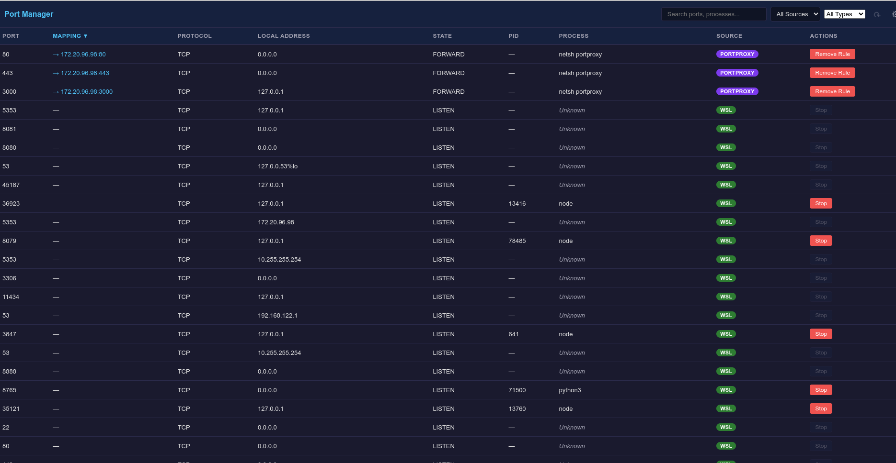

# ⚡ Port Manager

See every port on your system in one place — and stop anything with one click.

Scans **Docker**, **SSH tunnels**, **kubectl port-forwards**, **WSL**, **Windows**, **macOS**, and **Linux** ports simultaneously. Shows port forwarding relationships so you always know what's connected where.



## Why?

Ever had a port conflict and spent 5 minutes figuring out what's using it? Port Manager shows everything in real time:

- Docker container mappings (`3000 → 3000`)
- SSH tunnel forwards (`8080 → 80`)
- kubectl port-forwards (`9090 → 9090`)
- netsh portproxy rules (`→ 172.20.96.98:80`)
- Regular processes listening on ports

## Install

```bash
git clone https://github.com/alli959/port-manager.git
cd port-manager
npm install
npm start
```

## Features

| Feature | Description |
|---------|-------------|
| **Multi-source scanning** | Docker, SSH, K8s, PortProxy, WSL, Windows, macOS, Linux |
| **Mapping column** | Shows forwarding relationships (e.g., `→ 4000`) |
| **Source-aware actions** | Stop Container / Disconnect / Remove Rule / Stop |
| **Filters** | By source, by type (Direct / Forwarded), full-text search |
| **Themes** | Dark, Light, or follow system |
| **Auto-refresh** | 1s to 30s intervals, or manual |
| **Cross-platform** | Works on WSL+Windows, macOS, or native Linux |

## CLI

```bash
node bin/cli.js list    # List all ports in terminal
```

## Development

```bash
npm test     # 138 tests across 12 suites
npm start    # Launch app
```

## License

MIT
